# 🔄 Flujo Completo: "Nuevo Tipo a Partir de Documentos"

Este diagrama explica en detalle el proceso de inferencia automática de tipos de documentos, incluyendo todas las variaciones, excepciones y llamadas a APIs.

## 📊 Diagrama Principal

```mermaid
flowchart TB
    %% Inicio
    START([👤 Usuario: Click en 'Nuevo tipo a partir de documentos'])
    UPLOAD[📤 Usuario sube 1-10 archivos PDF]
    
    START --> UPLOAD
    UPLOAD --> VALIDATE
    
    %% Validación
    VALIDATE{¿Archivos válidos?<br/>1-10 PDFs}
    VALIDATE -->|❌ NO| ERROR_VALIDATION[❌ Error: Archivos inválidos]
    VALIDATE -->|✅ SÍ| PASO1
    
    ERROR_VALIDATION --> END_ERROR([🛑 FIN: Error mostrado al usuario])
    
    %% ========================================================================
    %% PASO 1: CLASIFICACIÓN Y AGRUPACIÓN
    %% ========================================================================
    PASO1[📋 <b>PASO 1:</b> Clasificar y Agrupar Documentos]
    
    PASO1 --> LOAD_TYPES
    LOAD_TYPES[(🗄️ PostgreSQL: Cargar<br/>tipos existentes del usuario)]
    LOAD_TYPES --> CLASSIFY_INIT
    
    CLASSIFY_INIT[🔄 Iniciar clasificación<br/>en batches de 3]
    CLASSIFY_INIT --> CLASSIFY_LOOP
    
    %% Loop de clasificación
    CLASSIFY_LOOP{🔁 ¿Hay más<br/>documentos?}
    CLASSIFY_LOOP -->|SÍ| CLASSIFY_BATCH
    CLASSIFY_LOOP -->|NO| CLASSIFY_COMPLETE
    
    CLASSIFY_BATCH[📦 Procesar batch<br/>de 3 documentos en paralelo]
    CLASSIFY_BATCH --> API_CLASSIFY
    
    %% Llamada API 1: Clasificación
    API_CLASSIFY[🌐 <b>API CALL 1-N:</b><br/>Gemini inferFieldsForUnclassified<br/>para cada documento]
    API_CLASSIFY --> API_CLASSIFY_CHECK
    
    API_CLASSIFY_CHECK{¿Error 429?}
    API_CLASSIFY_CHECK -->|❌ SÍ| ERROR_429_CLASSIFY
    API_CLASSIFY_CHECK -->|✅ NO| CLASSIFY_SUCCESS
    
    ERROR_429_CLASSIFY[⏱️ Error 429: Cuota excedida<br/>retryDelay: 35s]
    ERROR_429_CLASSIFY --> CLASSIFY_FAIL
    CLASSIFY_FAIL[❌ Clasificación fallida<br/>Proceso abortado]
    CLASSIFY_FAIL --> END_ERROR
    
    CLASSIFY_SUCCESS[✅ Tipo inferido:<br/>ej. 'Orden de Compra']
    CLASSIFY_SUCCESS --> CHECK_EXISTING
    
    CHECK_EXISTING{¿Tipo existe<br/>en BD?}
    CHECK_EXISTING -->|SÍ| MARK_EXISTING[📌 Marcar como EXISTENTE]
    CHECK_EXISTING -->|NO| MARK_NEW[🆕 Marcar como NUEVO]
    
    MARK_EXISTING --> ADD_TO_MAP
    MARK_NEW --> ADD_TO_MAP
    
    ADD_TO_MAP[📊 Agregar a Map:<br/>tipo → archivos]
    ADD_TO_MAP --> CLASSIFY_LOOP
    
    CLASSIFY_COMPLETE[✅ Clasificación completada<br/>Map: tipo → archivos + existingType?]
    CLASSIFY_COMPLETE --> PASO2
    
    %% ========================================================================
    %% PASO 2: HOMOLOGACIÓN DE NOMBRES
    %% ========================================================================
    PASO2[🔀 <b>PASO 2:</b> Homologar Nombres Similares]
    
    PASO2 --> CHECK_HOMOLOG_NEEDED
    CHECK_HOMOLOG_NEEDED{¿Hay 2+ tipos<br/>NUEVOS?}
    CHECK_HOMOLOG_NEEDED -->|NO| SKIP_HOMOLOG[⏭️ Saltar homologación]
    CHECK_HOMOLOG_NEEDED -->|SÍ| API_HOMOLOG
    
    SKIP_HOMOLOG --> PASO3
    
    %% Llamada API N+1: Homologación
    API_HOMOLOG[🌐 <b>API CALL N+1:</b><br/>Gemini homologateTypeNames<br/>Fusiona tipos similares]
    API_HOMOLOG --> API_HOMOLOG_CHECK
    
    API_HOMOLOG_CHECK{¿Error 429?}
    API_HOMOLOG_CHECK -->|❌ SÍ| ERROR_429_HOMOLOG
    API_HOMOLOG_CHECK -->|✅ NO| HOMOLOG_SUCCESS
    
    ERROR_429_HOMOLOG[⏱️ Error 429<br/>Usar nombres originales]
    ERROR_429_HOMOLOG --> PASO3
    
    HOMOLOG_SUCCESS[✅ Tipos fusionados<br/>ej. 'Orden Retiro' + 'Orden Despacho/Retiro'<br/>→ 'Orden de Retiro']
    HOMOLOG_SUCCESS --> MERGE_TYPES
    
    MERGE_TYPES[🔗 Fusionar archivos<br/>de tipos equivalentes]
    MERGE_TYPES --> PASO3
    
    %% ========================================================================
    %% PASO 3: PROCESAMIENTO POR TIPO
    %% ========================================================================
    PASO3[🔄 <b>PASO 3:</b> Procesar Cada Tipo]
    
    PASO3 --> TYPE_LOOP
    TYPE_LOOP{🔁 ¿Hay más<br/>tipos en Map?}
    TYPE_LOOP -->|NO| PROCESS_COMPLETE
    TYPE_LOOP -->|SÍ| CHECK_TYPE_STATUS
    
    CHECK_TYPE_STATUS{¿Tipo EXISTE<br/>en BD?}
    CHECK_TYPE_STATUS -->|SÍ| PATH_EXISTING
    CHECK_TYPE_STATUS -->|NO| PATH_NEW
    
    %% ========================================================================
    %% CAMINO A: TIPO EXISTENTE
    %% ========================================================================
    PATH_EXISTING[📂 <b>CAMINO A:</b> Tipo Existente]
    
    PATH_EXISTING --> CHECK_UPLOAD_EXISTING
    CHECK_UPLOAD_EXISTING{¿uploadSamples<br/>= true?}
    CHECK_UPLOAD_EXISTING -->|NO| SKIP_UPLOAD_EXISTING
    CHECK_UPLOAD_EXISTING -->|SÍ| PROCESS_EXISTING_DOCS
    
    SKIP_UPLOAD_EXISTING[⏭️ No subir documentos]
    SKIP_UPLOAD_EXISTING --> ADD_TO_RESULTS_EXISTING
    
    PROCESS_EXISTING_DOCS[🔄 Procesar documentos<br/>con schema existente]
    PROCESS_EXISTING_DOCS --> EXISTING_DOC_LOOP
    
    EXISTING_DOC_LOOP{🔁 ¿Más docs<br/>en grupo?}
    EXISTING_DOC_LOOP -->|NO| ADD_TO_RESULTS_EXISTING
    EXISTING_DOC_LOOP -->|SÍ| API_EXTRACT_EXISTING
    
    %% Llamadas API para tipo existente
    API_EXTRACT_EXISTING[🌐 <b>API CALL:</b><br/>Gemini extractDataWithVision<br/>usando schema existente]
    API_EXTRACT_EXISTING --> CHECK_429_EXTRACT_EXISTING
    
    CHECK_429_EXTRACT_EXISTING{¿Error 429?}
    CHECK_429_EXTRACT_EXISTING -->|❌ SÍ| ERROR_EXTRACT_EXISTING
    CHECK_429_EXTRACT_EXISTING -->|✅ NO| EXTRACT_EXISTING_SUCCESS
    
    ERROR_EXTRACT_EXISTING[❌ Error extrayendo<br/>Documento omitido]
    ERROR_EXTRACT_EXISTING --> EXISTING_DOC_LOOP
    
    EXTRACT_EXISTING_SUCCESS[✅ Datos extraídos]
    EXTRACT_EXISTING_SUCCESS --> UPLOAD_DRIVE_EXISTING
    
    UPLOAD_DRIVE_EXISTING[☁️ Google Drive:<br/>Subir archivo a carpeta existente]
    UPLOAD_DRIVE_EXISTING --> CHECK_DRIVE_ERROR_EXISTING
    
    CHECK_DRIVE_ERROR_EXISTING{¿Error Drive?}
    CHECK_DRIVE_ERROR_EXISTING -->|SÍ| ERROR_DRIVE_EXISTING
    CHECK_DRIVE_ERROR_EXISTING -->|NO| SAVE_DB_EXISTING
    
    ERROR_DRIVE_EXISTING[❌ Error subiendo<br/>Documento omitido]
    ERROR_DRIVE_EXISTING --> EXISTING_DOC_LOOP
    
    SAVE_DB_EXISTING[(💾 PostgreSQL: Guardar documento<br/>con extractedData)]
    SAVE_DB_EXISTING --> EXISTING_DOC_LOOP
    
    ADD_TO_RESULTS_EXISTING[📊 Agregar a resultados:<br/>tipo + docs agregados]
    ADD_TO_RESULTS_EXISTING --> TYPE_LOOP
    
    %% ========================================================================
    %% CAMINO B: TIPO NUEVO
    %% ========================================================================
    PATH_NEW[🆕 <b>CAMINO B:</b> Tipo Nuevo]
    
    PATH_NEW --> EXTRACT_FIELDS_INIT
    
    %% PASO 3.1: Extracción inicial de campos
    EXTRACT_FIELDS_INIT[📊 <b>PASO 3.1:</b> Extracción Inicial de Campos]
    EXTRACT_FIELDS_INIT --> EXTRACT_LOOP
    
    EXTRACT_LOOP{🔁 ¿Más docs<br/>en grupo?}
    EXTRACT_LOOP -->|NO| CHECK_EXTRACTED
    EXTRACT_LOOP -->|SÍ| API_EXTRACT_FIELDS
    
    %% Llamadas API de extracción
    API_EXTRACT_FIELDS[🌐 <b>API CALL:</b><br/>Gemini inferFieldsForUnclassified<br/>extrae campos individuales]
    API_EXTRACT_FIELDS --> CHECK_429_EXTRACT
    
    CHECK_429_EXTRACT{¿Error 429?}
    CHECK_429_EXTRACT -->|❌ SÍ| ERROR_429_EXTRACT
    CHECK_429_EXTRACT -->|✅ NO| EXTRACT_SUCCESS
    
    ERROR_429_EXTRACT[⏱️ Error 429: Cuota excedida<br/>Documento omitido]
    ERROR_429_EXTRACT --> EXTRACT_LOOP
    
    EXTRACT_SUCCESS[✅ Campos extraídos<br/>ej. 14 campos]
    EXTRACT_SUCCESS --> EXTRACT_LOOP
    
    CHECK_EXTRACTED{¿Al menos 1 doc<br/>extraído?}
    CHECK_EXTRACTED -->|NO| ERROR_NO_EXTRACTION
    CHECK_EXTRACTED -->|SÍ| CONSOLIDATE
    
    ERROR_NO_EXTRACTION[❌ Error: No se extrajo<br/>ningún campo<br/>Tipo omitido]
    ERROR_NO_EXTRACTION --> TYPE_LOOP
    
    %% PASO 3.2: Consolidación de campos
    CONSOLIDATE[🔧 <b>PASO 3.2:</b> Consolidar Campos]
    
    CONSOLIDATE --> API_CONSOLIDATE
    
    %% Llamada API de consolidación
    API_CONSOLIDATE[🌐 <b>API CALL:</b><br/>Gemini consolidateFieldsByType<br/>Homologa campos similares]
    API_CONSOLIDATE --> CHECK_429_CONSOLIDATE
    
    CHECK_429_CONSOLIDATE{¿Error 429?}
    CHECK_429_CONSOLIDATE -->|❌ SÍ| ERROR_429_CONSOLIDATE
    CHECK_429_CONSOLIDATE -->|✅ NO| CONSOLIDATE_SUCCESS
    
    ERROR_429_CONSOLIDATE[⏱️ Error 429: Proceso abortado<br/>❌ FALLO CRÍTICO]
    ERROR_429_CONSOLIDATE --> END_ERROR
    
    CONSOLIDATE_SUCCESS[✅ Schema consolidado<br/>ej. 19 campos únicos]
    CONSOLIDATE_SUCCESS --> CHECK_UPLOAD_NEW
    
    %% PASO 3.3: Re-extracción (opcional)
    CHECK_UPLOAD_NEW{¿uploadSamples<br/>= true?}
    CHECK_UPLOAD_NEW -->|NO| SKIP_REEXTRACT
    CHECK_UPLOAD_NEW -->|SÍ| REEXTRACT
    
    SKIP_REEXTRACT[⏭️ Saltar re-extracción<br/>y subida de documentos]
    SKIP_REEXTRACT --> CREATE_FOLDER
    
    REEXTRACT[🔄 <b>PASO 3.3:</b> Re-extraer con Schema Unificado]
    REEXTRACT --> REEXTRACT_LOOP
    
    REEXTRACT_LOOP{🔁 ¿Más docs<br/>para re-extraer?}
    REEXTRACT_LOOP -->|NO| CREATE_FOLDER
    REEXTRACT_LOOP -->|SÍ| API_REEXTRACT
    
    %% Llamadas API de re-extracción
    API_REEXTRACT[🌐 <b>API CALL:</b><br/>Gemini extractDataWithVision<br/>usando schema consolidado]
    API_REEXTRACT --> CHECK_429_REEXTRACT
    
    CHECK_429_REEXTRACT{¿Error 429?}
    CHECK_429_REEXTRACT -->|❌ SÍ| ERROR_429_REEXTRACT
    CHECK_429_REEXTRACT -->|✅ NO| REEXTRACT_SUCCESS
    
    ERROR_429_REEXTRACT[⏱️ Error 429<br/>Documento omitido]
    ERROR_429_REEXTRACT --> REEXTRACT_LOOP
    
    REEXTRACT_SUCCESS[✅ Datos re-extraídos<br/>con schema unificado]
    REEXTRACT_SUCCESS --> REEXTRACT_LOOP
    
    %% PASO 3.4: Crear recursos
    CREATE_FOLDER[📂 <b>PASO 3.4:</b> Crear Carpeta en Drive]
    
    CREATE_FOLDER --> DRIVE_CREATE
    DRIVE_CREATE[☁️ Google Drive API:<br/>createFolder]
    DRIVE_CREATE --> CHECK_DRIVE_ERROR_NEW
    
    CHECK_DRIVE_ERROR_NEW{¿Error Drive?}
    CHECK_DRIVE_ERROR_NEW -->|SÍ| ERROR_DRIVE_NEW
    CHECK_DRIVE_ERROR_NEW -->|NO| DRIVE_SUCCESS
    
    ERROR_DRIVE_NEW[❌ Error creando carpeta<br/>Tipo omitido]
    ERROR_DRIVE_NEW --> TYPE_LOOP
    
    DRIVE_SUCCESS[✅ Carpeta creada<br/>ID: 1Pzv...]
    DRIVE_SUCCESS --> SAVE_TYPE
    
    %% PASO 3.5: Guardar en BD
    SAVE_TYPE[💾 <b>PASO 3.5:</b> Guardar Tipo en BD]
    
    SAVE_TYPE --> NORMALIZE_FIELDS
    NORMALIZE_FIELDS[🔧 Normalizar tipos de campos<br/>email/phone → string<br/>currency → number]
    NORMALIZE_FIELDS --> DB_SAVE_TYPE
    
    DB_SAVE_TYPE[(🗄️ PostgreSQL: INSERT<br/>document_types<br/>⚠️ SIN TRANSACCIÓN)]
    DB_SAVE_TYPE --> CHECK_DB_ERROR_TYPE
    
    CHECK_DB_ERROR_TYPE{¿Error BD?}
    CHECK_DB_ERROR_TYPE -->|SÍ| ERROR_DB_TYPE
    CHECK_DB_ERROR_TYPE -->|NO| TYPE_CREATED
    
    ERROR_DB_TYPE[❌ Error guardando tipo<br/>Tipo omitido]
    ERROR_DB_TYPE --> TYPE_LOOP
    
    TYPE_CREATED[✅ Tipo creado en BD<br/>ID: 7]
    TYPE_CREATED --> CHECK_UPLOAD_DOCS
    
    %% PASO 3.6: Subir documentos (opcional)
    CHECK_UPLOAD_DOCS{¿uploadSamples<br/>= true?}
    CHECK_UPLOAD_DOCS -->|NO| ADD_TO_RESULTS_NEW
    CHECK_UPLOAD_DOCS -->|SÍ| UPLOAD_DOCS
    
    UPLOAD_DOCS[📤 <b>PASO 3.6:</b> Subir Documentos]
    UPLOAD_DOCS --> UPLOAD_LOOP
    
    UPLOAD_LOOP{🔁 ¿Más docs<br/>para subir?}
    UPLOAD_LOOP -->|NO| ADD_TO_RESULTS_NEW
    UPLOAD_LOOP -->|SÍ| UPLOAD_TO_DRIVE
    
    UPLOAD_TO_DRIVE[☁️ Google Drive:<br/>uploadFile]
    UPLOAD_TO_DRIVE --> CHECK_UPLOAD_ERROR
    
    CHECK_UPLOAD_ERROR{¿Error Drive?}
    CHECK_UPLOAD_ERROR -->|SÍ| ERROR_UPLOAD
    CHECK_UPLOAD_ERROR -->|NO| SAVE_DOCUMENT
    
    ERROR_UPLOAD[❌ Error subiendo<br/>Documento omitido]
    ERROR_UPLOAD --> UPLOAD_LOOP
    
    SAVE_DOCUMENT[(💾 PostgreSQL: INSERT documents<br/>con extractedData re-extraído)]
    SAVE_DOCUMENT --> UPLOAD_LOOP
    
    ADD_TO_RESULTS_NEW[📊 Agregar a resultados:<br/>tipo nuevo creado]
    ADD_TO_RESULTS_NEW --> TYPE_LOOP
    
    %% ========================================================================
    %% FIN
    %% ========================================================================
    PROCESS_COMPLETE[✅ Procesamiento completo]
    PROCESS_COMPLETE --> RETURN_RESULTS
    
    RETURN_RESULTS[📊 Retornar resultados:<br/>- Tipos creados<br/>- Tipos actualizados<br/>- Campos consolidados<br/>- Documentos agregados]
    
    RETURN_RESULTS --> END_SUCCESS([🎉 FIN: Modal de éxito<br/>mostrado al usuario])
    
    %% Estilos
    classDef errorClass fill:#ff6b6b,stroke:#c92a2a,color:#fff
    classDef successClass fill:#51cf66,stroke:#2f9e44,color:#fff
    classDef apiClass fill:#4dabf7,stroke:#1971c2,color:#fff
    classDef dbClass fill:#ffd43b,stroke:#f59f00,color:#000
    classDef driveClass fill:#a78bfa,stroke:#7c3aed,color:#fff
    classDef decisionClass fill:#ffa94d,stroke:#e67700,color:#000
    
    class ERROR_VALIDATION,ERROR_429_CLASSIFY,CLASSIFY_FAIL,ERROR_429_EXTRACT,ERROR_NO_EXTRACTION,ERROR_429_CONSOLIDATE,ERROR_EXTRACT_EXISTING,ERROR_DRIVE_EXISTING,ERROR_DRIVE_NEW,ERROR_DB_TYPE,ERROR_UPLOAD,ERROR_429_HOMOLOG,ERROR_429_REEXTRACT errorClass
    
    class CLASSIFY_SUCCESS,EXTRACT_SUCCESS,CONSOLIDATE_SUCCESS,HOMOLOG_SUCCESS,REEXTRACT_SUCCESS,EXTRACT_EXISTING_SUCCESS,DRIVE_SUCCESS,TYPE_CREATED,PROCESS_COMPLETE successClass
    
    class API_CLASSIFY,API_HOMOLOG,API_EXTRACT_FIELDS,API_CONSOLIDATE,API_REEXTRACT,API_EXTRACT_EXISTING apiClass
    
    class LOAD_TYPES,DB_SAVE_TYPE,SAVE_DB_EXISTING,SAVE_DOCUMENT dbClass
    
    class DRIVE_CREATE,UPLOAD_DRIVE_EXISTING,UPLOAD_TO_DRIVE driveClass
    
    class VALIDATE,API_CLASSIFY_CHECK,CHECK_EXISTING,CHECK_HOMOLOG_NEEDED,API_HOMOLOG_CHECK,TYPE_LOOP,CHECK_TYPE_STATUS,CHECK_UPLOAD_EXISTING,EXISTING_DOC_LOOP,CHECK_429_EXTRACT_EXISTING,CHECK_DRIVE_ERROR_EXISTING,EXTRACT_LOOP,CHECK_429_EXTRACT,CHECK_EXTRACTED,CHECK_429_CONSOLIDATE,CHECK_UPLOAD_NEW,REEXTRACT_LOOP,CHECK_429_REEXTRACT,CHECK_DRIVE_ERROR_NEW,CHECK_DB_ERROR_TYPE,CHECK_UPLOAD_DOCS,UPLOAD_LOOP,CHECK_UPLOAD_ERROR decisionClass
```

---

## 📈 Análisis de Llamadas a Gemini API

### **Ejemplo: 4 documentos, 2 tipos nuevos**

| Etapa | Llamadas | Acumulado | Momento |
|-------|----------|-----------|---------|
| **Clasificación inicial** | 4 | 4 | 0-10s |
| **Homologación de nombres** | 1 | 5 | 10s |
| **Extracción tipo 1 (2 docs)** | 2 | 7 | 11-18s |
| **Consolidación tipo 1** | 1 | 8 | 27s |
| **Re-extracción tipo 1 (2 docs)** | 2 | 10 | 28-37s |
| **Extracción tipo 2 (2 docs)** | 2 | 12 | ⚠️ **LÍMITE EXCEDIDO** |

**Límite de tier gratuito:** 10 RPM (requests per minute)

**Resultado:** Error 429 en la etapa de extracción del tipo 2.

---

## ⚠️ Problemas Identificados

### **1. Falta de transaccionalidad**
- ✅ "Orden de Retiro" se crea en BD
- ❌ "Orden de Compra" falla por 429
- ❌ BD queda en estado inconsistente
- ❌ Al reintentar, "Orden de Retiro" ya existe → duplicados

### **2. Sin retry automático**
- Gemini responde con `retryDelay: 35s`
- Código NO espera → falla inmediatamente

### **3. Sin rate limiting proactivo**
- Hace 10+ llamadas en <1 minuto
- No respeta límite de 10 RPM

### **4. Procesamiento secuencial bloqueante**
- Si un tipo falla, afecta los siguientes
- No hay aislamiento entre tipos

---

## 🔑 Puntos Críticos de Fallo

1. **Clasificación (API CALL 1-N)**: Si falla aquí, todo el proceso se aborta
2. **Consolidación (API CALL)**: Fallo crítico que deja BD inconsistente
3. **Creación en BD (INSERT)**: Sin transacción, no hay rollback
4. **Google Drive**: Si falla, el tipo queda sin carpeta

---

## 📊 Contadores de Operaciones

Para **4 documentos** que generan **2 tipos nuevos** con `uploadSamples=true`:

| Operación | Cantidad | Reversible |
|-----------|----------|------------|
| **Llamadas Gemini API** | 12-14 | ❌ No |
| **Inserts PostgreSQL** | 3 (1 tipo + 2 docs por tipo) | ❌ No |
| **Creaciones Google Drive** | 2 carpetas + 4 archivos | ❌ No |
| **Lecturas PostgreSQL** | 1 (tipos existentes) | ✅ Sí |

**Problema:** Sin transacciones, cualquier fallo deja recursos creados que no se revierten.

---

## 🎯 Recomendaciones

1. **Implementar transacciones de BD completas**
2. **Agregar retry con backoff exponencial**
3. **Rate limiting proactivo (delays de 6s entre llamadas)**
4. **Procesamiento idempotente (detectar tipos ya creados)**
5. **Logging detallado de estado para debugging**
6. **Migrar a API de pago para producción**

---

## 🔗 Referencias

- Código: `backend/src/document-types/services/document-type-inference.service.ts`
- Método principal: `inferDocumentTypesFromSamples()`
- Controller: `backend/src/document-types/document-types.controller.ts`
- Endpoint: `POST /api/document-types/infer-from-samples`

