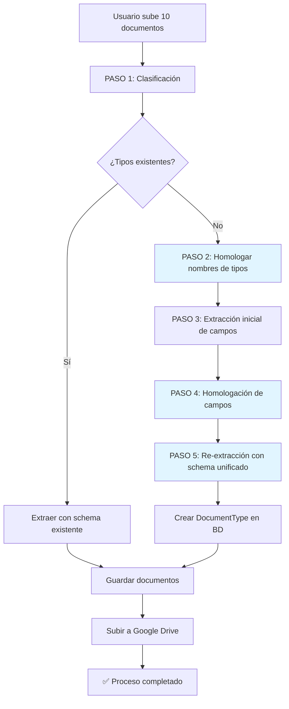

# 🔬 Sistema Avanzado de Homologación de Campos

## 📋 Descripción General

Este documento describe el sistema mejorado de inferencia de tipos de documento que incluye:

1. **Homologación de nombres de tipos** - Fusiona tipos similares ("Orden de Retiro" + "Orden de Despacho / Retiro" → "Orden de Retiro")
2. **Homologación de campos** - Agrupa campos equivalentes de diferentes documentos
3. **Re-extracción con schema unificado** - Garantiza que todos los documentos tengan exactamente los mismos campos

---

## 🎯 Problema que Resuelve

### Antes (Problema):
```
Subir 8 documentos "Orden de Compra":

Documento 1:  [seller_name, seller_rut, order_date, ...]
Documento 2:  [issuing_company_name, vendor_name, ...]
Documento 3:  [order_number, supplier_name, ...]
...

❌ Problema: Cada documento tiene campos con NOMBRES DIFERENTES
❌ Problema: El schema final no coincide con los documentos guardados
❌ Problema: "Orden de Retiro" y "Orden de Despacho / Retiro" se crean como tipos separados
```

### Ahora (Solución):
```
Subir 8 documentos "Orden de Compra" + 2 "Orden de Retiro/Despacho":

PASO 1: Clasificar
  - 8 docs → "Orden de Compra"
  - 1 doc → "Orden de Despacho / Retiro"
  - 1 doc → "Orden de Retiro"

PASO 2: Homologar nombres de tipos
  - "Orden de Despacho / Retiro" + "Orden de Retiro" → "Orden de Retiro" (2 docs fusionados)

PASO 3: Extracción inicial de campos
  - Doc 1: [seller_name, seller_rut, order_date, ...]
  - Doc 2: [issuing_company_name, vendor_name, ...]
  - ...

PASO 4: Homologación de campos (IA analiza equivalencias)
  - seller_name ≈ issuing_company_name ≈ supplier_name → "vendedor_nombre_empresa"
  - seller_rut ≈ issuing_company_rut ≈ supplier_rut → "vendedor_rut"
  - order_date ≈ fecha_emision ≈ generation_date → "fecha_orden"
  - ...
  - Schema consolidado: 20 campos únicos con nombres consistentes

PASO 5: Re-extracción con schema unificado
  - Gemini re-procesa los 8 documentos usando el schema consolidado
  - TODOS los documentos ahora tienen EXACTAMENTE los mismos 20 campos
  - Valores extraídos correctamente según el schema final

✅ Resultado: 8 docs con schema IDÉNTICO, datos limpios y consistentes
✅ Resultado: Solo 2 tipos creados ("Orden de Compra" y "Orden de Retiro")
```

---

## 🔄 Flujo Completo



---

## 🛠️ Implementación Técnica

### 1️⃣ Método: `homologateTypeNames()`

**Propósito:** Fusionar tipos semánticamente equivalentes

**Ejemplo:**
```typescript
Input: Map {
  "Orden de Retiro" => [file1.pdf],
  "Orden de Despacho / Retiro" => [file2.pdf, file3.pdf]
}

Gemini analiza y decide:
  "Orden de Despacho / Retiro" ≈ "Orden de Retiro" → FUSIONAR

Output: Map {
  "Orden de Retiro" => [file1.pdf, file2.pdf, file3.pdf]
}
```

**Prompt a Gemini:**
```
Tengo estos tipos de documentos NUEVOS identificados:
1. "Orden de Retiro"
2. "Orden de Despacho / Retiro"

TAREA: Agrupa los tipos que son SEMÁNTICAMENTE EQUIVALENTES.

EJEMPLOS DE EQUIVALENCIAS:
- "Orden de Compra" ≈ "Orden Compra" ≈ "Purchase Order" → MISMO TIPO
- "Orden de Retiro" ≈ "Orden de Despacho / Retiro" → MISMO TIPO

INSTRUCCIONES:
1. Identifica grupos de tipos que son REALMENTE EQUIVALENTES
2. Elige el nombre MÁS CLARO Y ESPECÍFICO en español
3. SÉ CONSERVADOR: solo agrupa si estás seguro

FORMATO DE RESPUESTA (JSON):
{
  "merges": [
    {
      "canonical_name": "Orden de Retiro",
      "variants": ["Orden de Despacho / Retiro", "Orden de Retiro"]
    }
  ]
}
```

---

### 2️⃣ Método: `consolidateFieldsByType()`

**Propósito:** Homologar campos equivalentes de múltiples documentos

**Ejemplo:**
```typescript
Input: 3 documentos "Orden de Compra"
  Doc 1: [seller_name, seller_rut, order_date, buyer_name, ...]
  Doc 2: [issuing_company_name, issuing_company_rut, generation_date, client_name, ...]
  Doc 3: [supplier_name, supplier_rut, order_date, buyer_company_name, ...]

Gemini analiza equivalencias:
  seller_name ≈ issuing_company_name ≈ supplier_name
  seller_rut ≈ issuing_company_rut ≈ supplier_rut
  order_date ≈ generation_date
  buyer_name ≈ client_name ≈ buyer_company_name

Output: Schema consolidado
  [
    { name: "vendedor_nombre_empresa", type: "string", label: "Nombre de Empresa Vendedora", ... },
    { name: "vendedor_rut", type: "string", label: "RUT del Vendedor", ... },
    { name: "fecha_orden", type: "date", label: "Fecha de la Orden", ... },
    { name: "comprador_nombre", type: "string", label: "Nombre del Comprador", ... },
    ...
  ]
```

**Prompt a Gemini:**
```
Tengo 3 documentos tipo "Orden de Compra" con estos campos extraídos:

DOCUMENTO 1 (OC_Ausin.pdf):
  - seller_name (string): "Nombre del Vendedor" [REQUERIDO]
  - seller_rut (string): "RUT del Vendedor" [REQUERIDO]
  - order_date (date): "Fecha de Orden"
  ...

DOCUMENTO 2 (OC_Caceres.pdf):
  - issuing_company_name (string): "Empresa Emisora" [REQUERIDO]
  - issuing_company_rut (string): "RUT Empresa"
  - generation_date (date): "Fecha de Generación"
  ...

TAREA: Consolida estos campos en UN SOLO SCHEMA definitivo.

INSTRUCCIONES:
1. Identificar campos equivalentes (mismo concepto, nombres diferentes)
2. Elegir mejor nombre (snake_case, español, descriptivo)
3. Determinar si es required (≥50% de documentos)
4. Limitar a máximo 20 campos (los más importantes)

FORMATO DE RESPUESTA (JSON):
{
  "typeDescription": "Documento comercial...",
  "consolidatedFields": [
    {
      "name": "vendedor_nombre_empresa",
      "type": "string",
      "label": "Nombre de Empresa Vendedora",
      "required": true,
      "description": "Razón social de la empresa vendedora",
      "frequency": 1.0
    },
    ...
  ]
}
```

---

### 3️⃣ Método: `reExtractWithUnifiedSchema()`

**Propósito:** Re-extraer datos de documentos usando el schema consolidado

**Por qué es necesario:**
- La extracción inicial usa campos "abiertos" (Gemini inventa nombres)
- La consolidación define el schema final
- Los documentos guardados deben usar el schema final, no los nombres iniciales

**Proceso:**
```typescript
// 1. Crear "pseudo DocumentType" con schema consolidado
const pseudoType = {
  name: "Orden de Compra",
  fieldSchema: {
    fields: [
      { name: "vendedor_nombre_empresa", type: "string", ... },
      { name: "vendedor_rut", type: "string", ... },
      ...
    ]
  }
}

// 2. Re-extraer cada documento usando el schema consolidado
for (const file of files) {
  const extractedData = await geminiClassifier.extractDataWithVision(
    file.buffer,
    file.mimetype,
    pseudoType  // ✅ Gemini usará estos campos específicos
  );
  
  // extractedData ahora tiene EXACTAMENTE los campos del schema consolidado
}
```

**Resultado:**
```json
// ANTES (extracción inicial)
{
  "fields": [
    { "name": "seller_name", "value": "Austín Hnos SpA" },
    { "name": "seller_rut", "value": "76.123.456-7" },
    ...
  ]
}

// DESPUÉS (re-extracción con schema unificado)
{
  "fields": [
    { "name": "vendedor_nombre_empresa", "value": "Austín Hnos SpA" },
    { "name": "vendedor_rut", "value": "76.123.456-7" },
    { "name": "vendedor_direccion", "value": "Av. Principal 123" },
    { "name": "fecha_orden", "value": "2024-11-01" },
    ...
    // ✅ TODOS los documentos tienen ESTOS MISMOS campos
  ]
}
```

---

## 📊 Costo de Llamadas a API (Gemini)

### Para 10 documentos (8 "Orden de Compra" + 2 "Orden de Retiro")

| Paso | Llamadas | Tipo | Costo Estimado |
|------|----------|------|----------------|
| **1. Clasificación inicial** | 10 | Identificar tipo (sin campos completos) | ~$0.01 |
| **2. Homologación de tipos** | 1 | Analizar similitud de nombres | ~$0.001 |
| **3. Extracción inicial de campos** | 10 | Extraer campos abiertos | ~$0.02 |
| **4. Consolidación de campos** | 2 | Homologar campos (1 por tipo único) | ~$0.002 |
| **5. Re-extracción con schema** | 10 | Re-extraer con schema fijo | ~$0.02 |
| **TOTAL** | **33 llamadas** | | **~$0.05-0.10 USD** |

**Nota:** Los costos son estimaciones basadas en Gemini 2.5 Flash. El costo real puede variar.

---

## 🎯 Ventajas del Sistema

| Ventaja | Descripción |
|---------|-------------|
| ✅ **Consistencia total** | Todos los documentos del mismo tipo tienen EXACTAMENTE los mismos campos |
| ✅ **Nombres unificados** | No hay duplicados como "Orden de Retiro" vs "Orden de Despacho / Retiro" |
| ✅ **Alta precisión** | Usa IA para homologar, no reglas fijas (más inteligente) |
| ✅ **Escalable** | Funciona con 2 o 100 documentos |
| ✅ **Datos limpios** | Re-extracción garantiza calidad y cumplimiento del schema |
| ✅ **Respeta tipos existentes** | Si el tipo ya existe en BD, usa su schema sin modificarlo |

---

## 🧪 Cómo Probar

### Escenario 1: Tipos Mixtos (Existente + Nuevos)
```powershell
# 1. Crear tipo "Orden de Compra" manualmente con 25 campos
# 2. Subir 10 documentos:
#    - 4 Orden de Compra (tipo existente)
#    - 3 Contrato de Trabajo (nuevo)
#    - 3 Certificado Médico (nuevo)

# Resultado esperado:
# - Orden de Compra: 4 docs con 25 campos (schema existente)
# - Contrato de Trabajo: 3 docs con ~18 campos (schema consolidado)
# - Certificado Médico: 3 docs con ~12 campos (schema consolidado)
```

### Escenario 2: Tipos Similares (Homologación)
```powershell
# Subir 10 documentos:
#    - 8 Orden de Compra
#    - 1 Orden de Despacho / Retiro
#    - 1 Orden de Retiro

# Resultado esperado:
# - Orden de Compra: 8 docs con ~20 campos consolidados
# - Orden de Retiro: 2 docs fusionados con ~15 campos consolidados
#   (homologa "Orden de Despacho / Retiro" + "Orden de Retiro" → "Orden de Retiro")
```

### Escenario 3: Tipo Único (Consolidación Intensiva)
```powershell
# Subir 10 documentos "Orden de Compra" (todos el mismo tipo)

# Resultado esperado:
# - Orden de Compra: 1 tipo creado
# - 10 docs con EXACTAMENTE los mismos ~20-25 campos
# - Campos homologados (seller_name + issuing_company_name + ... → vendedor_nombre_empresa)
```

---

## 📝 Logs del Proceso

Ejemplo de logs que verás en el backend:

```
🚀 Iniciando inferencia de tipos desde 10 documentos de ejemplo
🔍 Clasificando 10 documentos...
   📄 Clasificando 1/10: OC_Ausin.pdf
   ✅ OC_Ausin.pdf: "Orden de Compra"
   📄 Clasificando 2/10: OC_Caceres.pdf
   ✅ OC_Caceres.pdf: "Orden de Compra"
   ...
   📄 Clasificando 9/10: Retiro_001.pdf
   ✅ Retiro_001.pdf: "Orden de Despacho / Retiro"
   📄 Clasificando 10/10: Retiro_002.pdf
   ✅ Retiro_002.pdf: "Orden de Retiro"
✅ 10 documentos clasificados en 3 tipo(s)

🔀 Homologando 2 nombres de tipos nuevos...
   🔗 Gemini detectó 1 fusión(es)
   🔀 Fusionando: Orden de Despacho / Retiro, Orden de Retiro → "Orden de Retiro"
   ✅ Homologación completa: 3 → 2 tipos

📦 Procesando grupo "Orden de Compra" (8 documentos)...
   🆕 Tipo "Orden de Compra" es nuevo. Iniciando proceso de consolidación...
   📊 Extrayendo campos de 8 documentos...
      📄 Extrayendo campos de "OC_Ausin.pdf"...
      ✅ Extraídos 22 campos de "OC_Ausin.pdf"
      📄 Extrayendo campos de "OC_Caceres.pdf"...
      ✅ Extraídos 18 campos de "OC_Caceres.pdf"
      ...
   🔧 Consolidando campos de 8 documentos...
   ✅ Schema consolidado: 20 campos únicos
   🔄 Re-extrayendo datos con schema consolidado...
      📄 Re-extrayendo: OC_Ausin.pdf
      ✅ Re-extracción completada para OC_Ausin.pdf
      ...
   ✅ Re-extracción completada: 8 documentos procesados
   📂 Creando carpeta en Google Drive...
   ✅ Carpeta creada: 1A2B3C4D5E6F
   💾 Guardando tipo en base de datos...
   ✅ Tipo "Orden de Compra" creado (ID: 1)
   📤 Subiendo 8 documentos con datos unificados...
      ✅ "OC_Ausin.pdf" guardado (ID: 1)
      ✅ "OC_Caceres.pdf" guardado (ID: 2)
      ...
   ✅ Todos los documentos subidos con schema unificado

📦 Procesando grupo "Orden de Retiro" (2 documentos)...
   (proceso similar...)

🎉 Proceso completado: 2 tipo(s) procesado(s)
```

---

## 🚀 Conclusión

Este sistema garantiza que:

1. ✅ Los documentos del mismo tipo tienen campos **100% idénticos**
2. ✅ Los tipos similares se **fusionan automáticamente**
3. ✅ Los datos guardados usan el **schema final consolidado**, no los campos iniciales
4. ✅ El proceso es **inteligente** (usa IA para homologar) y **robusto** (fallbacks en caso de error)

---

**Implementado en:** `backend/src/document-types/services/document-type-inference.service.ts`

**Fecha:** Noviembre 2024

**Versión:** 2.0 (Sistema Avanzado de Homologación)

